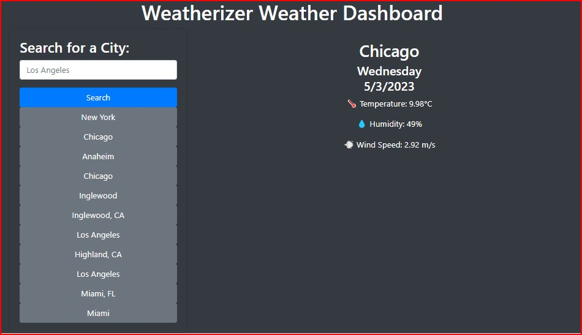

# Weatherizer

## Description

Weatherizer is a the week-six assignment for UC Berkeley Coding Bootcamp. The Weatherizer weather dashboard that allows you to search for a city and get a 5-day weather forecast.  It will save your most recent search for easy access the next time you launch the app.  The Weatherizer uses the OpenWeather API to retrieve weather data.  It also uses `localStorage` to store persistent data.

## Table of Contents
 * [Description](#description)
 * [Usage](#usage)
 * [License](#license)
 * [Screenshot](#screenshot)
 * [About](#about)
 * [GitHub Repository](#github-repository)
 * [Link to Deployed Application](#link-to-deployed-application)
 * [Questions](#questions)

## Usage

To view the weather forecast for a specific city, navigate to the deployed application and enter the name of the city in the search bar. The weather dashboard will display the current weather conditions and a 5-day forecast for the city. The city name will also be added to the search history. If you want to view the weather conditions for a previously searched city, simply click on the city name in the search history, and the dashboard will update to show the current weather and 5-day forecast for that city.

## License

None

## Screenshot

## About

This project was created by Christopher Dean.  I can be reached at coderchrisdean@gmail.com

## GitHub Repository

https://github.com/coderchrisdean/weatherized-nation

## Link to Deployed Application

https://coderchrisdean.github.io/weatherized-nation/

## Questions

If you have any questions about this application, I can be reached via email at coderchrisdean@gmail.com.

** INCOMPLETE BUT FETCHED API DATA IS STORED IN LOCAL STORAGE AND LOGGED TO CONSOLE **